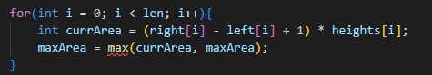

# Approach
In this problem we use the same algorithm as the Leetcode `84. Largest Rectangle in Histogram` where we have to find the largest rectangle from the provided histogram in the form of an array.

So Here we have used this concept as a function `maxRect` where we find the maximum rectangle for every row including the previous one

## **For Eg:**

In the first test case

The matrix given is matrix = [["1","0","1","0","0"],["1","0","1","1","1"],["1","1","1","1","1"],["1","0","0","1","0"]]

### In this matrix we will divide each while including the previous row such the height of each colum will be the sum of 1s and if the current column is 0 then it will be 0 (like in the fourth row) and calculate the maximun rectangle using the function rows:

*  It will be the first row since there is no row previous to this hence will send it to the function directly.

    

 

*  For the second row, we will be including the first one as well. Such that if there are two 1s in the same column we will make it 2 and if there is 0 in column of the current row then we will mark it as 0 only. Therefor the 2nd row we will send to the function will be: 

    

    Hence the Row 2 that we will send to find the maximum rectangle will be [2, 0, 2, 1, 1].

*  Similarily for the third row (We will be including all the above two rows along with the third row)
    
    
    
    Hence for teh row 3 we will send [3, 1, 3, 2, 2]

* Similarily for Fourth row (We will be including all the above three rows along with the fourth row):

    

    Hence we will be sending [4, 0, 0, 3, 0]

After sending all these values the maximum value obtained throung the return of the function will be the maximum rectangle that can be formed 

In this case it wil be 6

# **About the funciont**

In the function, The first two for loop is to find the left and right limit for each element provided in the function.

* **Left Limit: The nearest height of the array which is less than the current height**

    For Eg:
    
    
    
    in this, let the current element be the second last element i.e. 2, So the left limit will be the second element i.e. 1 because it is the nearest left element that is less than the current element.

* **Right Limit: The nearest height of the array which is less than the current height**

    For Eg:
    
    
    
    in this, let the current element be the first element i.e. 3, So the right limit will be the second element i.e. 1 because it is the nearest right element that is less than the current element.

### After Calculating the left and the right limit we are finding the maximum rectangle that can be formed by the provided arrya `heights`.

* The formula for finding the area of maximum rectangle is: 
    
    `(leftLimit - RightLimit + 1) * currentHeight` 

    In the provided program

    

    This loop is for calculating the maximum area of the rectangle that can be formed by the provided array.

